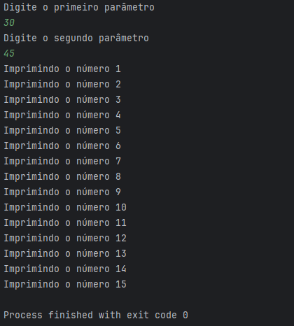

# Desafio de Controle de Fluxo  

## Nome
Desafio de Controle de Fluxo

## Descrição
Desenvolver um sistema que deverá receber dois parâmetros via terminal que representarão dois números inteiros, com estes dois números você deverá obter a quantidade de interações (for) e realizar a impressão no console (System.out.print) dos números incrementado.

## Funcionalidades
O sistema recebe dois valores de entrada para calcular a diferença e imprimir os resultados.

## Tecnologias
- Java v17.0

## Requisitos
- Necessário alguma IDE (IntelliJ, Visual Studio Code, Eclipse, etc); 

## Inicialização
1 - Faça um clone do repositório através do git.

2 - Após realizar o procedimento acima, você pode abrir o Contador.java que está localizado na raiz do projeto (diretório principal) na IDE de sua preferência, rode o sistema e insira os valores no terminal.

3 - O resultado será apresentado via terminal (no meu caso, utilizei o IntelliJ):

   

## Colaboradores
Bruna Stefani Moreira Torres Francisco <a href="https://www.linkedin.com/in/bruna-moreira-torres-francisco/" target="_blank">LinkedIn</a>

## Status do Projeto
Concluído.
